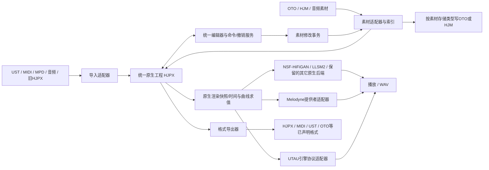

# UTAU 功能补齐、统一原生编辑器与素材管理器实施方案

状态：待用户审核。本文是静态审计与设计，不代表已实施或通过运行验收。本轮未修改应用源码、未运行 ex 回归脚本、未写入真实音源。

## 1. 审核基线与目标

对照版本：`../ex/juce/src`；实施基线：当前 `juce/src`，Git 基线 `a5fe498` 加本会话已有的 Windows 构建、Direct2D/软件回退、菜单语言、缩放按钮等修改。ex 是无 .git 的源码快照，不能假定它整体更新或直接覆盖当前目录。

以现有 `.hjpx`、`ProjectData / TrackData / ClipData / NoteData / NativeSegment / NativeConnection` 为基础演进，继续使用一种原生工程格式。当前工程序列化版本为 14；HJM CSV 是素材标注文件，不等同于整个 HJPX 工程。

编辑能力必须是以下集合的并集：

`UTAU 特有 + Melodyne 特有 + 两者共有 + 本项目原创`

相同或相近的操作合并为一套工具与命令。导入来源、素材磁盘格式、渲染引擎均不得决定是否保留编辑能力或工程数据。只有缺少操作对象时才提示选择素材/音符；不能仅因“这是一条 MPD 导入轨”就禁止歌词、OTO 视图、包络或颤音，也不能仅因“这是 UST 导入轨”就禁止音高漂移、调制、共振峰和原生分段。

所有工程级可编辑内容须随 HJPX 保存、恢复、复制、撤销/重做。切换渲染引擎不得清空它不支持的字段。源音频仍可以外部引用；“保存所有编辑数据”不意味着默认把所有 WAV 和外部音源库复制进 HJPX。

## 2. 已证实的现状与差异

下面的“已有”表示代码存在，不代表本轮已运行通过。README 有过时描述，审计以执行代码为准。

| 功能组 | 当前版本 | ex 的补充 / 实施要求 |
| --- | --- | --- |
| UTAU 基础 | 已有经典/界/谋选择、外部 resampler、prefix.map、时序、STP、旗标、休止处理、选区合成 | 保留基础，迁入边界修复；不能把整套基础功能重复实现 |
| UST 导入 | 已有歌词、音符、Tempo、PB 系列音高、Envelope、Velocity、Intensity、覆盖时序 | 补 VBR 七参数；补日文 Shift-JIS/GBK 跨系统解码；补打开工程/加入轨道两种语义 |
| 导入音高保真 | 当前没有 ex 的自动转音策略字段 | ex 对 UST 关闭编辑器自动 S 转音，防止改写原始曲线；迁成统一连接策略，不能用来源布尔值控制后续编辑 |
| 跨音符音高 | 当前有 NativeConnection，但没有 ex 的 SharedPitchLines 实现 | 补跨音符 PBS 覆盖、曲线交接、拖点与渲染一致；结合现有原生连接，避免另造一套 UTAU 工程曲线 |
| 颤音 | 已有参数、显示与转标点 | 补颤音终点及对应拖动/序列化，修复 UST 颤音读取；保留现有源 F0 调制、漂移语义 |
| 响度包络 | 已有包络、预设、部分编辑与渲染 | 补基础百分比、幅度线性/dB 线性区分、更多预设及拆分插值；显示/试听/渲染共用求值器 |
| 单音符 OTO | 有时序覆盖和库级 OTO 编辑，但无完整 ex 的单音符 OTO 覆盖对象 | 补单音符源区间/固定区/预发声/重叠/截止/分段覆盖、恢复库值、随工程保存；不得把单音符覆盖误写全库 |
| OTO 编辑与试听 | 已有 OTO 列表、波形、界/谋标注、别名复制 | 补 ex 的原音试听和编辑器交互；在素材管理器中复用这些组件 |
| 歌词编辑 | 已有批量歌词等 | 补 Tab/Shift+Tab 跨片段连续编辑、汉字转拼音；ex 的拼音只取常用读音，不是完整多音字/音素器 |
| 零时值拼字音符 | 已有部分时序操作 | 补 ex 的前置拼字、界模式只读前两区、正确重叠与区域线行为；在原生模型表达前置发音事件 |
| flag 扩展 | 已有多参数曲线与分区 flag | 补 MY 等 ex 支持项；经典协议不能误发扩展位置参数。统一编辑器仍保留全部曲线，发送差异只在引擎适配器 |
| 合成波形 | 已有 UTAU 波形显示 | 补单音符独立音频片段、预发声对齐、包络前后波形、包络调整不无故清空音色缓存 |
| 音源索引 | 当前有缓存，但主要是同步载入/线性匹配 | 补异步索引、别名查询表、文件变更检测、写入修订号和不阻塞 UI；迁到素材服务而非让编辑层直接问渲染器 |
| HF 外部引擎 | 没有 ex 的 daemon 预热接口 | 按外部引擎能力补预热、解释器路径/进程状态，保留失败诊断；不得将它混同于本项目原生 NSF-HiFiGAN |
| MIDI 互通 | 已有 MIDI 导入 | 补 ex 的单轨选择导入和含歌词/拍号/Tempo 的 MIDI 导出；共用原生时间映射 |
| MCP | 当前已有工程与素材操作 | 补迁入功能对应的 schema、字段、快照、恢复和行为验证，确保 GUI/CLI/MCP 使用同一命令服务 |
| 素材管理 | 两份 AssetManagerComponent 实现基本一致，只有音频路径登记列表 | 新增真正的库/素材/别名层次、搜索、试听、编辑、重定位、引用关系与持久化管理 |

关键证据位置（相对两棵源码树）：

- ex `ProjectModel.h:242–350`：单音符 OTO、自动转音策略、颤音终点、包络基础值；`:424–498`：SharedPitchLines；`:570–613`：MIDI/UST 增强。
- ex `backend/UstImporter.cpp:119–179`：跨编码解码；`:291–313`：VBR；`ProjectModel.cpp:1629–1644`：导入转换。
- ex `backend/UtauRenderer.h:151–238`：索引、预热、协议与局部覆盖；`AudioEngine.h:21–46`：逐音符波形。
- 当前 `ProjectModel.h:18–58, 258–270, 433–472`：已经存在的统一原生分段、连接与工程。
- 当前 `ProjectModel.cpp:4421–4425`：HJPX 版本 14。
- 两份 `AssetManagerComponent.cpp:7–173`：目前仅登记路径、UTAU 目录导入、移除登记和拖入拖出。

### 必须优先修复的架构与数据错误

1. **HJM 抢占整库 OTO。** 当前 `backend/UtauRenderer.cpp:358–362` 只要找到任意 HJM 音源结果就返回，不再读 OTO。一个部分生成的 HJM 集合就可能遮蔽其它 OTO 条目，也绕过界/谋扩展。改为明确的素材绑定和逐条素材身份，不再用“目录里有 HJM”推断全库权威源。
2. **注册/修改 UTAU 隐式写 HJM。** 当前 `SampleSettings.cpp:1181–1188` 注册音源生成 HJM；`:987–1011` 保存经典 OTO 后又刷新 HJM。ex 也有这个问题，不能原样迁入。注册、扫描、试听、渲染不得隐式写 HJM。
3. **HJM→OTO cutoff 公式错误。** 当前 `SampleSettings.cpp:775` 把尾裁剪量写成负数，但其导入器 `:724–728` 将负 cutoff 解释为从 offset 起的长度。例如总长 1 秒、起点 .2、终点 .8，当前导出 -200ms，导回终点变成 .4。应写正尾裁剪 +200ms 或负区间长度 -600ms，并做往返测试。
4. **OTO 导出覆盖整个目标。** 当前 `exportOto():783` 用当前音频条目替换整文件，不能复用为音源库编辑接口；导出与行级编辑必须分开。
5. **原生分段存在时跳过 UTAU 重绑定。** 当前 `ProjectModel.cpp:2930–2956` 看到 nativeSegments 即提前返回，跳过清理源录音相关时序/STP；UST 导入又会给音符填 nativeSegments。应按“是否更换素材绑定”清理覆盖，不能以是否有原生分段区分两套编辑语义。
6. **工程歌词修改包含素材磁盘副作用。** 当前 `ProjectModel.cpp:2882–2914, 2960–2998` 会写 HJM 标签。将“音符歌词/发音修改”和“修改素材别名/标注”拆为不同命令；保留用户明确进入素材编辑时的回写能力，保证工程撤销不与磁盘内容脱节。

## 3. 目标数据流

导入器结束后，工程编辑、撤销、剪贴板、曲线显示、预览请求及渲染调度之间只传统一原生数据。UST DTO、OTO 文本行、MPD 解析对象以及外部进程位置参数只存在于适配器边界。编辑器不再自行解析 OTO/MPD，也不从 UtauRenderer 读取时序作为唯一事实来源。

## 4. 原生模型如何承载全部工具

不是以一个笼统“兼容字段”掩盖两套项目，而是补齐同一模型所需的表达力：

- **素材身份与绑定**：稳定 materialId/regionId，音频引用、别名解析结果、源区间、音符局部覆盖、素材修订号。导入路径只记 provenance；标注存储格式独立记录为 OTO/HJM，渲染 provider 独立选择。
- **通用时序**：明确源录音绝对秒、素材区域局部秒、音符局部秒、工程秒和乐拍；毫秒只在 OTO/UTAU 协议边界换算。保留负重叠、预发声、固定段、STP、可伸缩分段及零时值前置事件，不用普通音符最短时长抹掉它们。
- **音高**：源 F0/去颤音源 F0、目标控制点、源调制/漂移、人工颤音和原生连接分别保留，统一求值一次。SharedPitchLines 的交接规则并入 NativeConnection/原生曲线求值，不能二次叠加 Melodyne join 或额外自动转音。
- **响度**：单套包络工具承载 gain、基础值和逐段插值方式；默认保持旧工程 dB 插值，不因增加 UTAU 幅度线性而改变现有 Melodyne 包络听感。
- **发音与分段**：现有 NativeSegment 任意段数继续有效；经典、界、谋的 2/3/4 区和 C/V/S 是素材/协议映射预设，不是三个新的工程种类。保持未知与过渡别名的已有原生语义，不能把所有 '-'/'_' 强行解释成休止。
- **引擎扩展**：把无法通用解释的 flags 与扩展曲线保存在有名称/版本的原生参数容器中，由 UTAU 适配器翻译；切换引擎后仍可编辑、保存。不能无声地把 g=20 当成某个通用共振峰单位。
- **全量序列化**：HJPX 保存上述字段、连接、素材绑定与快照、局部覆盖、曲线形状、插值域、颤音终点、发音事件、引擎设置及版本。新增字段都有旧文件默认值；旧 UTAU 字段通过加载迁移到统一结构，不保留两套同时可写的权威数据。

素材标注的磁盘格式可以不同，但工程中编辑对象的结构与工具是一套。HJPX 必须保留有效素材描述快照，外部 OTO 更新时可检测差异并刷新绑定；缺失音源时仍可打开和编辑工程，渲染时明确报告未解析素材。

## 5. 工具合并规则

| 合并后工具/面板 | 覆盖内容 | 不可错误等同的语义 |
| --- | --- | --- |
| 音高编辑 | 移调、音高线/标点、自然/线性/贝塞尔、调制、漂移、自动/手工转音 | 源 F0 与目标曲线分开；源颤音调制与人工 VBR 不能相互覆盖 |
| 时序与源区间 | 音符长度/移动、Attack、辅音边界、预发声、重叠、STP、局部素材覆盖 | AttackSpeed 与 UTAU consonant velocity 不是简单同单位数值；经原生时间映射求值 |
| 响度包络 | 幅度、增益、基础值、线性域、预设、接缝交叉淡化 | 包络、轨道音量、素材增益分别参与一次，防止重复乘算 |
| 颤音 | 参数式颤音、终点拖动、显示、转标点 | 烘焙后不得再叠加原参数式颤音 |
| 连接与拼接 | NativeConnection、Melodyne pitch/amplitude join、UTAU 预发声交叠、前置拼字 | 数据来源不决定连接；不同接缝的语义保留为同一连接模型的属性 |
| 发音/歌词 | 原生别名、歌词、拼音转换、批量输入、Tab 连续输入、素材选择 | 可见歌词与实际选中的素材别名要能区分，多音字需允许人工修正 |
| 音色/引擎参数 | 原生共振峰/气声/张力等与扩展 flag 曲线 | 通用参数与特定引擎 flag 不做未经验证的单位映射 |
| 素材编辑 | 原生分段、OTO 六参数视图、界/谋扩展、波形试听 | 库级编辑与音符局部覆盖入口明确，不能混写 |

工具可用性以是否有相应对象/数据为依据，而非以 UTAU/Melodyne 导入标志或 pitchAlgorithm 为门控。渲染能力检查只影响输出是否可执行、是否需要烘焙/适配，不影响原生编辑和存盘。

### 5.1 审核补充：等价转换也必须合并

统一不是把两组控件放进同一个窗口。编辑器不提供“UTAU编辑模式/Melodyne编辑模式”切换；一个操作只有一个原生命令、权威结果和撤销记录。可通过下列手段实现等价操作的，都进入同一工具：

| 统一操作 | 可以合并的原有表达 | 转换/补齐办法 |
| --- | --- | --- |
| 目标音高与滑音 | UST PBS/PBW/PBY/PBM、原生标点、MPD手工音高/连接 | 导入为原生目标曲线及连接，统一处理音符前后的曲线所有权，渲染时采样成目标引擎所需曲线 |
| 颤音 | 源录音中的周期起伏、参数VBR、已烘焙音高点 | 统一颤音工具：从源曲线分析/提取、参数生成或转为控制点；保留源分析与非破坏参数，不能简单重复叠加；任意起伏不能强制无损拟合为正弦 |
| 音高调制/漂移 | 已录音源F0与音源库样本F0 | 对已解析的音源库样本按需分析，建立统一源曲线，复用调制/漂移工具；平直人工音高也可直接编辑，不因UST来源禁用 |
| 辅音/起音时序 | Melodyne Attack、OTO固定区/预发声、辅音速度、界/谋分段 | 都编辑原生源到目标时间映射。速度数值先转换为有效边界/比例，再由渲染适配器转换为协议；不能把两种速度简单设成同一数字 |
| 源区间编辑 | OTO offset/cutoff/STP、MPD源范围、HJM区域 | 统一为源区间与局部位移；OTO字段作为数值视图，任何已有录音都可进入此视图，无OTO文件也可在工程内编辑 |
| 连接/拼接 | Melodyne音高/幅度接缝、UTAU overlap/预发声交叠、原创拼接 | 统一连接对象中的音高、时序、幅度子属性；一次工具操作协调修改，不做多个独立接缝重复处理 |
| 音量/包络 | UST Intensity/Envelope、Melodyne音符幅度、原生增益及包络基值 | 统一响度工具，单位适配和插值域显式保存；引擎不支持时可在公共混音层完成等价增益/包络 |
| 素材分段 | OTO经典/界/谋区域、HJM任意分段、MPD起音/元音/齿音 | 同一原生分段编辑器；经典与界/谋仅为分段/导出预设；齿音、噪声等不能因映射C/V而丢失 |
| 发音、歌词与取样 | UTAU歌词/别名/prefix.map、原生标签、音频片段选择 | 一个发音与素材绑定工具；已有录音保留原绑定，也可主动换为音源库别名，原音源库音符也可固定为已解析录音区域 |
| 共振峰、气声、张力等 | 原生音色参数与具备对应意义的引擎flags | 已知引擎经参数/音频验证后建立映射，或公共DSP等价实现；不能只凭flag名称宣称效果等价 |

等价优先级：直接共用原生运算 → 单位/坐标转换 → 补充素材分析 → 曲线/时间映射转换 → 公共前后处理 → 明确、可恢复的渲染快照烘焙。烘焙仅作用于派生快照/缓存，工程里的高层参数及可编辑数据不得被覆盖。不能用任意后处理宣称恢复了专有引擎内部处理顺序；精确与近似的范围要通过用例证实。

### 5.2 真正保留独立的边界

- 导入/导出文件语法、编码及OTO/HJM写回策略各自独立，内存编辑对象统一。
- 各渲染引擎调用、协议、能力、缓存实现独立；不形成各自的编辑器。
- 录音F0、目标音高、歌词、素材别名等描述不同事实的字段不能硬合成一个值，但必须由同一套编辑服务协调维护，而非重复权威状态。
- 暂无等价实现的专有参数保留为通用参数/自动化面板中的扩展项，所有来源工程均可编辑并存盘；当前引擎是否能执行另行说明，不归类为“某来源工程专属”。缺少等价实现时不能伪装应用成功，也不清空该编辑意图。
- 工程局部覆盖与全局素材编辑按作用范围区分；这不是UTAU/Melodyne模式区分。

验收新增硬条件：任何以来源类型、旧utauMode或pitchAlgorithm决定整组编辑工具可见性的判断，都要逐项移除或改为数据依赖提示。仅把按钮显示出来不算完成；必须实现原生命令、保存恢复、显示求值和可执行的渲染计划。缺素材时允许保留编辑意图并补全/分析素材，而不是切回另一编辑模式。

## 6. OTO/HJM 权威源与写回规则

1. **登记 UTAU 音源**：读取 oto.ini/prefix.map/可用扩展，在内存转换为统一素材结构，登记索引；默认不创建 `.hjm.csv`，不写 OTO。
2. **编辑 UTAU 素材**：波形边界、数值、别名等通过素材事务写回实际 OTO。经典字段写对应 OTO；用户明确启用的界/谋扩展写对应扩展文件，不互相覆盖。保留原编码、换行、其它行、未识别字段；以身份和文件修订校验避免写错行。
3. **编辑单个音符的局部素材参数**：保存 HJPX 内的原生覆盖，不改库 OTO、不生成 HJM；支持恢复库值。用户若明确执行“应用到素材库”，才转为库级修改。
4. **普通/HJM 素材**：继续使用现有 HJM 标注；原生素材编辑按该素材的存储策略写 HJM，保留 Melodyne 导入及原生标注能力。
5. **同时有 OTO 和旧 HJM 的音源**：不删除任何文件；UTAU 登记默认绑定 OTO，HJM 不自动抢占。显式 HJM 登记仍可用，并在管理器标明来源，避免两套写回竞争。
6. **HJM→OTO**：独立导出动作，修正 cutoff；支持新建、合并或显式替换，不默默覆盖其它音频条目。显示不可表示的信息：任意段数、原生连接、音高/包络等不能全部塞入标准 OTO。原生数据始终保留在 HJPX/HJM，按目标能力生成 OTO/扩展或导出警告。
7. **提交一致性**：读回验证、同目录临时文件原子替换、失败可恢复、库级撤销和外部修改冲突检测；提交成功后统一失效索引/渲染缓存。工程编辑的撤销与素材文件修改的撤销分别记录，不假装一份内存 undo 能撤回外部文件。

## 7. 素材管理器

在已有登记列表基础上整合 VoicebankSettingsComponent 与 OtoWaveformEditorComponent，提供统一入口：

- 登记音频、目录、UTAU 音源、HJM 素材库；按稳定 ID 去重，取消登记不删除文件。
- 库 → 录音 → 区域/别名视图；按名称、别名、角色、音阶、标注类型、缺失状态搜索过滤。
- 原音/选区试听，波形与标注预览；后台扫描、进度、取消，列表虚拟化，避免大音源库阻塞 UI。
- 原生分段视图与 OTO 参数视图共享底层素材；编辑别名/时序/区域，复制别名，显示真正写入的文件位置。
- 明确区分“修改素材库”与“本音符覆盖”；显示被哪些工程对象引用及外部标注变更。
- 素材路径重定位、失效检测、重新扫描；绑定ID保持稳定，不能只靠文件名/行号识别。
- 从管理器拖入工程时携带素材 ID/区域 ID，而非只拖 WAV 路径导致 OTO/别名信息丢失。
- HJM→OTO 导出、OTO 条目合并；显示不可表示字段与冲突结果。
- 注册表放应用数据中，HJPX 保存本工程引用及编辑快照；不把整个全局素材目录硬塞进每个工程。

## 8. 渲染与导出边界

统一快照生成有效源区间、目标音高、时间映射、包络、连接和已解析素材。然后由适配器组装 NSF-HiFiGAN、LLSM2、UTAU 或 Melodyne 的请求。公共调度、取消、进度、缓存与错误通道保持一致。

- UTAU 适配器负责位置参数、采样步长、pitch 编码、经典/扩展 flags、引擎目录和外部进程；引擎扩展能力单独检测，不能向所有 resampler 强发界/谋协议。
- 保留现有 NSF-HiFiGAN 同源连续组处理、边界保护、LLSM2 和已验证路由；禁止恢复 ex 的默认 mld5 或未经说明的静默 fallback。
- 当前真实 Melodyne 接口**尚未接通**：`MelodyneProvider.cpp:61–65,130–143` 明确标记原生导入/渲染不可用，探测和创建 VST3 实例不等于完整数据交换/渲染。ex 的 Mld5/Mld3 是自研算法，不应冠以真实 Melodyne。
- “调用 Melodyne”设独立适配器里程碑：核实本机插件/许可及内容交换能力，完成原生数据到插件的协议映射与音频回收验证；只有端到端通过才标记可用。若当前插件接口不能承载所需离线内容，明确提出可行宿主/桥接方案审核，不伪装成功，也不影响其它功能实施。
- 对引擎无法表达的原生参数：可精确下放的交给引擎；可明确烘焙的由公共层烘焙一次；不可表达的列出具体项并明确失败或由用户选择导出策略。切换引擎不删数据。
- 输出优先完整覆盖 ex 已有 WAV/MIDI/OTO 能力；增加 UST 导出作为 UTAU 互通闭环。ex 未实现的 UST 字段、音素器或完整 Melodyne 功能不能被写成“已迁移”；必须分别记录能力和验收范围。

## 9. 分阶段实施及放行条件

### 阶段 0：冻结功能矩阵与回归基线

保存当前工作区差异；逐个登记 ex 的 UTAU UI 命令、模型字段、MCP 方法、渲染行为和 smoke 分支，标记已有/需迁移/需重构/与新要求冲突，所有项必须有归属，不能因合并 UI 而丢行为。素材和工程测试均用副本；ex/tools/regress.sh 有结束所有 HachiShifter 进程和真实路径依赖，不直接执行原脚本。

### 阶段 1：统一模型、序列化与素材绑定

增加必要原生字段、通用曲线求值、素材引用/覆盖、存储策略、连接语义；HJPX 升版与兼容读取；移除依赖导入来源的两套编辑分支。先验收字段往返、撤销、复制、切引擎不丢数据。

### 阶段 2：导入和素材存储修复

UST 编码/VBR/音高保真/打开与叠轨，MIDI 单轨导入；OTO/HJM 适配器和权威源选择；杜绝 UTAU 隐式 HJM；修正 OTO cutoff/合并/写回事务。验收标准 OTO 数值和编码往返，真实文件保持不变。

### 阶段 3：统一编辑工具补齐

迁入 ex 的共享音高、包络、颤音尾端、单音符 OTO、拼字、歌词导航、拼音、试听与波形细节。按第5节合并，保留已有原创和 Melodyne 编辑能力，不恢复按算法隐藏整套工具的旧 UI。

### 阶段 4：渲染适配与性能

补 UTAU 索引/缓存、预热、协议边界、单音符音频与曲线一致性；切换引擎测试、混合工程测试，保证 NSF/LLSM2/Melodyne已有转换路径不回退。真实 Melodyne 提供者独立验证。

### 阶段 5：素材管理器与导出闭环

整合库/素材/区域管理、直接 OTO 编辑、局部覆盖、试听/搜索/重定位、引用与刷新；WAV/MIDI/OTO/UST 导出。GUI 与 MCP 使用同一服务。

### 阶段 6：Windows 原生构建与联合验收

使用 `E:\hjs-tc` 现有 MSYS2/xwin 工具链；构建与测试缓存放 E 盘，不新增 WSL 依赖。保留本轮之前的 GPU/软件回退、缩放符号、菜单语言等修复。

## 10. 最终验收标准

1. **功能覆盖**：ex 的每一项已确认 UTAU 能力在矩阵中均有对应工具/服务、测试与结果；合并项标明对应关系，不以“看起来差不多”验收。
2. **来源无关**：同一测试场景分别从 UST/MPD/MIDI/原生工程进入后，可调用相同工具；工具结果写入相同结构，HJPX 往返不丢字段。
3. **引擎无损切换**：UTAU → NSF/LLSM2 → UTAU 后原生工程编辑信息完整，未知或不支持的扩展不清空；不可用引擎明确报错。
4. **OTO 写入纪律**：注册/扫描/试听/渲染 UTAU 库前后文件清单和哈希不变；修改一个素材只改预期 OTO/扩展条目，无隐式 HJM；单音符覆盖仅改工程。
5. **曲线一致**：显示、预览与最终输出使用一致时间/曲线解释；覆盖负 PBS、负 overlap、零预发声、零时值拼字、变速、多片段、单音符覆盖、音高前后交接。
6. **序列化**：新字段、任意分段、原生连接、音符覆盖、基值/插值域、颤音尾端、素材绑定、引擎扩展全部有保存/读取与撤销/重做测试；旧项目默认听感不变。
7. **Melodyne 回归**：保留 MPD 的 sourceTimeMap、source F0/withoutVibrato、modulation/drift、Attack、sibilants、gain、formant、join/crossfade、beat origin 及 NSF 合并组语义；使用已确认工程/参考音频比较，固定配置下未修改路径要求一致或有明确数值容差依据。
8. **音频与缓存**：沿用 ex 的 flags、区域、包络、rest、splice、UST/prefix 等测试意图，补原生统一表示；对相同引擎和确定性设置做音频/调用参数差分。随机或神经输出不能仅以文件哈希作结论。
9. **素材规模与交互**：大音源库扫描可取消、UI不等待全盘读取；素材修改立即使必要缓存失效；路径重定位后仍能还原别名和绑定。
10. **不虚报能力**：本计划承诺补齐 ex 已实现能力及上述新增约束；不等同于自动实现 UTAU/Celemony 产品的全部未知或未公开功能。真实 Melodyne 原生渲染与格式导出必须单独提供证据。

## 11. 本轮审核要点

建议按本方案批准以下边界后实施：

- 以当前统一原生模型为唯一编辑模型，所有工具的并集进入统一编辑器；相似工具合并，但保留数学/时序语义差异。
- UTAU 素材默认 OTO 权威、素材编辑直写 OTO；单音符覆盖属于工程，不改音源库。HJPX 保存全部工程级编辑及必要素材快照。
- HJM 保留并支持导出 OTO；无法无损映射的字段必须明示，不能为了 OTO 降级原生格式。
- 先做完整 ex 功能对齐及统一层补齐；真实 Melodyne 提供者按独立能力里程碑验收，不冒用现有自研算法替代。

审核和修改完成后再开始实施。若需要调整阶段顺序、UST 导出范围或素材快照更新策略，可直接修改本方案要求。
