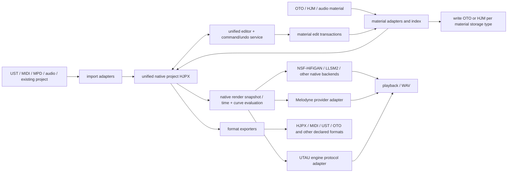

# Unified Native Editor — Design

Status: design specification for the unified native version. It describes the
target architecture; individual sections are requirements, not a claim that
every item is already implemented and verified.

## 1. Baseline and goal

The unified native version evolves a single native project format around
`ProjectData / TrackData / ClipData / NoteData / NativeSegment /
NativeConnection`. The HJM CSV is a per-material annotation file and is **not**
the same thing as the whole native project (HJPX).

Editing capability must be the union of four sets:

```
UTAU-specific + Melodyne-specific + shared + original to this project
```

Identical or near-identical operations are merged into one tool and one command.
The import source, the on-disk material format, and the render engine must never
decide whether an editing capability or a piece of project data is kept. The
editor only prompts for a material/note selection when an operation has no
object to act on. A track must not lose lyrics, an OTO view, envelopes, or
vibrato merely because it was imported from a Melodyne project; nor lose pitch
drift, modulation, formants, or native segmentation merely because it was
imported from a UST.

All project-level editable content is saved, restored, copied, and undone/redone
with the project. Switching render engines must not clear fields the engine does
not support. Source audio may still be referenced externally; "save all edit
data" does not mean copying every WAV and external voicebank into the project.

## 2. Architecture and data errors to fix first

These are correctness requirements the unified model must satisfy:

1. **A partial HJM set must not shadow a full OTO voicebank.** Authority comes
   from explicit material binding and per-entry identity, never from "there is
   an HJM file in the directory."
2. **Registering or editing a UTAU voicebank must not implicitly write HJM.**
   Registration, scanning, auditioning, and rendering never write HJM sidecars.
3. **HJM→OTO cutoff must be numerically correct.** OTO cutoff is either a
   positive tail-trim or a negative region length; the export/import pair must
   round-trip. (A naive "negative tail-trim" is wrong and moves the end point.)
4. **OTO export must not overwrite an entire target file.** Export and row-level
   library editing are separate paths.
5. **Presence of native segments must not skip material re-binding.** Overrides
   are reset by a change of material binding, not by whether native segments
   exist.
6. **Editing a note's lyric must not have material-disk side effects.** "Edit a
   note's lyric/pronunciation" and "edit a material's alias/annotation" are
   different commands with separate undo boundaries.

## 3. Target data flow



After import, only unified native data flows between project editing, undo,
clipboard, curve display, preview requests, and render scheduling. UST DTOs,
OTO text rows, and MPD parse objects exist only at adapter boundaries. The
editor never parses OTO/MPD itself, and never treats an engine adapter's timing
as the single source of truth.

## 4. How the native model carries every tool

Rather than hiding two projects behind a vague "compatibility field," the model
carries the expressiveness all tools need:

- **Material identity and binding:** stable `materialId` / `regionId`, audio
  reference, resolved alias, source region, per-note local override, material
  revision. Provenance is recorded on the import path; the annotation storage
  format (OTO/HJM) and the render provider are chosen independently.
- **General timing:** explicit source-recording absolute seconds, material-region
  local seconds, note-local seconds, project seconds, and beats. Milliseconds
  are converted only at the OTO/UTAU protocol boundary. Negative overlap,
  preutterance, fixed region, STP, stretchable segments, and zero-duration
  lead-in events are preserved and never collapsed by a minimum note length.
- **Pitch:** source F0 / de-vibrato source F0, target control points, source
  modulation/drift, manual vibrato, and native connections are kept separately
  and evaluated once. Cross-note hand-off rules fold into the native connection
  / native curve evaluation, without stacking a second Melodyne join or extra
  automatic transition.
- **Loudness:** one envelope tool carries gain, a base value, and per-segment
  interpolation; the existing dB interpolation stays the default so adding a
  linear-amplitude mode does not change existing envelopes' sound.
- **Pronunciation and segmentation:** arbitrary native segment counts stay
  valid; the classic 2-region and extended 3/4-region layouts and C/V/S classes
  are material/protocol mapping presets, not new project kinds. Unknown and
  transition aliases keep their native semantics; not every `-` / `_` is forced
  to a rest.
- **Engine extensions:** flags and extended curves that have no universal meaning
  are stored in a named, versioned native parameter container and translated by
  the UTAU adapter; they stay editable and saved across engine switches.
- **Full serialization:** HJPX saves the fields, connections, material bindings
  and snapshots, local overrides, curve shapes, interpolation domains, vibrato
  end points, pronunciation events, engine settings, and a version. New fields
  have defaults for old files; legacy fields migrate into the unified structure
  rather than keeping two writable authorities.

The on-disk annotation format may differ per material, but the in-project edit
objects and tools are one set. HJPX keeps a valid material-description snapshot,
can detect and refresh bindings when external OTO changes, and can still open
and edit a project with missing audio (reporting unresolved material at render
time).

## 5. Tool merging rules

| Merged tool / panel | Covers | Semantics that must not be conflated |
| --- | --- | --- |
| Pitch editing | transpose, pitch line/points, natural/linear/Bezier, modulation, drift, auto/manual transition | source F0 and target curve stay separate; source vibrato modulation and manual VBR do not overwrite each other |
| Timing and source region | note length/move, attack, consonant boundary, preutterance, overlap, STP, local material override | attack speed and UTAU consonant velocity are not the same-unit number; both resolve through the native time map |
| Loudness envelope | amplitude, gain, base value, linear domain, presets, seam crossfade | envelope, track volume, and material gain each apply once — no double multiply |
| Vibrato | parametric vibrato, end-point drag, display, bake to points | after baking, the original parametric vibrato is not stacked again |
| Connection and splicing | native connection, Melodyne pitch/amplitude join, UTAU preutterance overlap, lead-in syllable | the data source does not decide the connection; different seams are attributes of one connection model |
| Pronunciation / lyrics | native alias, lyrics, pinyin conversion, batch entry, Tab continuous entry, material selection | the visible lyric and the actually-selected material alias are distinguishable; polyphonic characters allow manual correction |
| Timbre / engine parameters | native formant/breath/tension and extended flag curves | universal parameters and engine-specific flags get no unverified unit mapping |
| Material editing | native segments, OTO parameter view, extended region annotation, waveform audition | library-level editing and per-note local override are distinct entry points |

Tool availability depends on whether the relevant object/data exists, not on an
import flag or `pitchAlgorithm`. A render-capability check only affects whether
output is executable or needs baking/adaptation — it never gates native editing
or saving.

### 5.1 Equivalent operations are merged too

Unifying is not putting two sets of controls in one window. The editor offers no
"UTAU edit mode / Melodyne edit mode" switch; one operation has one native
command, one authoritative result, and one undo record. Wherever an equivalent
operation can be produced, it enters the same tool:

- **Target pitch and portamento:** UST PBS/PBW/PBY/PBM, native points, and manual
  MPD pitch/connection import to one native target curve and connection model.
- **Vibrato:** periodic movement in the source recording, parametric VBR, and
  baked pitch points share one vibrato tool (analyze/extract, generate, or
  convert to control points) without simply re-stacking.
- **Pitch modulation/drift:** analyzed from resolved voicebank samples on demand;
  a flat manual pitch is also directly editable and not disabled by a UST source.
- **Consonant / attack timing:** Melodyne attack, OTO fixed region/preutterance,
  consonant velocity, and region annotations all edit the native source→target
  time map; speed numbers convert to effective boundaries/ratios first.
- **Source-region editing:** OTO offset/cutoff/STP, MPD source range, and HJM
  regions unify into a source region + local shift; any recording can enter this
  view even without an OTO file.
- **Loudness/envelope:** UST intensity/envelope, Melodyne note amplitude, and
  native gain + base value unify into one loudness tool with explicit unit
  adaptation and interpolation domain.

Equivalence priority: reuse native computation → unit/coordinate conversion →
supplementary material analysis → curve/time-map conversion → common
pre/post-processing → explicit, recoverable render-snapshot baking. Baking acts
only on derived snapshots/caches; high-level project parameters and editable data
are never overwritten.

### 5.2 What legitimately stays separate

- Import/export file syntax, encoding, and OTO/HJM write-back policy are
  independent; the in-memory edit objects are unified.
- Each render engine's calls, protocol, capability, and cache are independent;
  they do not each grow their own editor.
- Fields describing different facts (recording F0, target pitch, lyrics, material
  alias) are not fused into a single value, but are coordinated by one edit
  service rather than duplicated authorities.
- A proprietary parameter with no equivalent yet stays as an extension item on a
  generic automation panel, editable and saved from every source; whether the
  current engine can execute it is reported separately. Missing an equivalent
  must not fake success or clear the edit intent.

Hard acceptance rule: any check that gates a whole tool group by source type,
legacy mode, or `pitchAlgorithm` is removed or converted to a data-dependent
prompt. Merely showing a button is not "done"; the native command, save/restore,
display evaluation, and an executable render plan must all exist.

## 6. OTO / HJM authority and write-back rules

1. **Register a UTAU voicebank:** read `oto.ini` / `prefix.map` / available
   extensions, convert to the unified material structure in memory, and index it.
   By default do not create `.hjm.csv` and do not write OTO.
2. **Edit UTAU material:** waveform boundaries, values, and aliases write back to
   the real OTO through a material transaction. Classic fields write the matching
   OTO; user-enabled extensions write their own files without cross-overwriting.
   Preserve original encoding, line endings, other rows, and unrecognized fields;
   verify identity and file revision to avoid writing the wrong row.
3. **Edit a single note's local material parameters:** save the native override
   inside HJPX; do not change the library OTO and do not create HJM. Support
   restoring library values. Only an explicit "apply to library" becomes a
   library-level change.
4. **Plain / HJM material:** continue using the existing HJM annotation; native
   material edits write HJM per that material's storage policy.
5. **A voicebank that has both OTO and legacy HJM:** delete nothing; UTAU
   registration binds OTO by default and HJM does not auto-preempt. Explicit HJM
   registration remains available and is labelled by source.
6. **HJM→OTO:** a separate export action with corrected cutoff; supports new,
   merge, or explicit replace, and never silently overwrites other entries.
   Information that standard OTO cannot represent (arbitrary segment counts,
   native connections, pitch/envelope) stays in HJPX/HJM; OTO/extensions are
   generated per target capability, with export warnings.
7. **Commit consistency:** read-back verification, atomic same-directory temp
   replace, recoverable failure, library-level undo, and external-change conflict
   detection; on success, invalidate the index/render cache. Project-edit undo
   and material-file-edit undo are recorded separately.

## 7. Material manager

A unified entry point that integrates the voicebank settings and OTO waveform
components on top of the registration list:

- Register audio, folders, UTAU voicebanks, and HJM material libraries;
  de-duplicate by stable ID; un-registering never deletes files.
- Library → recording → region/alias views; filter by name, alias, role, scale,
  annotation type, and missing state.
- Original / region audition and waveform + annotation preview; background scan
  with progress and cancel; virtualized lists so large voicebanks never block the
  UI.
- A native-segment view and an OTO parameter view over the same underlying
  material; edit alias/timing/region, copy alias, and show the actual file that
  is written.
- Distinguish "edit the library" from "this note's override"; show which project
  objects reference a material and any external annotation change.
- Material relocation, staleness detection, re-scan; binding IDs stay stable
  rather than relying on file name / row number.
- Dragging into a project carries material ID / region ID, not just a WAV path.
- HJM→OTO export and OTO entry merge; show unrepresentable fields and conflicts.
- The registry lives in application data; HJPX stores this project's references
  and edit snapshots without stuffing the entire global material folder into
  every project.

## 8. Render and export boundaries

A unified snapshot produces the effective source region, target pitch, time map,
envelope, connections, and resolved material. Adapters then assemble the
NSF-HiFiGAN, LLSM2, UTAU, or Melodyne request. Common scheduling, cancellation,
progress, cache, and error channels stay consistent.

- The UTAU adapter owns positional arguments, sample step, pitch encoding,
  classic/extended flags, engine directory, and the external process; extended
  engine capability is detected separately and is not force-sent to every
  resampler.
- Existing NSF-HiFiGAN same-source contiguous-group handling, boundary guards,
  LLSM2, and validated routing are preserved; no silent fallback to a different
  backend.
- The real Melodyne interface is a separate provider milestone: verify local
  plugin/licence and content-exchange capability, map native data to the plugin
  protocol, and validate audio return; mark it available only after end-to-end
  success. Detecting or instantiating a plugin is not a completed data exchange.
- For native parameters an engine cannot express: pass through what maps exactly;
  bake once in the common layer what can be baked; list what cannot and fail
  explicitly or let the user pick an export strategy. Switching engines never
  deletes data.
- Output covers WAV / MIDI / OTO, plus UST export for UTAU interchange. Unmet UST
  fields, a phonemizer, or full Melodyne functionality are recorded separately,
  never written up as "migrated."

## 9. Phased implementation

- **Phase 0 — Freeze the feature matrix and regression baseline.** Register every
  UI command, model field, MCP method, render behavior, and smoke branch; mark
  each present / to-migrate / to-refactor / conflicting. Use copies for material
  and project tests.
- **Phase 1 — Unified model, serialization, material binding.** Add native
  fields, general curve evaluation, material reference/override, storage policy,
  and connection semantics; bump HJPX with compatible reads; remove
  source-dependent editing branches. Verify field round-trip, undo, copy, and
  engine switch.
- **Phase 2 — Import and material-storage fixes.** UST encoding/VBR/pitch
  fidelity/open-vs-append; single-track MIDI import; OTO/HJM adapters and
  authority selection; no implicit HJM; corrected OTO cutoff/merge/write
  transactions.
- **Phase 3 — Unified editing tools.** Shared pitch, envelope, vibrato end,
  per-note OTO, lead-in syllable, lyric navigation, pinyin, audition, and
  waveform detail — merged per section 5.
- **Phase 4 — Render adaptation and performance.** UTAU index/cache, prewarm,
  protocol boundaries, per-note audio and curve consistency; engine-switch and
  mixed-project tests; independent Melodyne provider verification.
- **Phase 5 — Material manager and export loop.** Library/material/region
  management, direct OTO editing, local override, audition/search/relocate,
  references and refresh; WAV/MIDI/OTO/UST export. GUI and MCP share one service.
- **Phase 6 — Native Windows build and joint acceptance.** Build with the native
  MSYS2/xwin toolchain (see `windows-build.md`); keep the GPU/software-render
  fallback, zoom controls, and menu-language support.

## 10. Final acceptance criteria

1. **Feature coverage:** every confirmed UTAU capability maps to a tool/service,
   a test, and a result; merged items state the correspondence.
2. **Source independence:** the same scenario entered from UST/MPD/MIDI/native
   project reaches the same tools; results write the same structure and HJPX
   round-trips without dropping fields.
3. **Lossless engine switch:** after UTAU → NSF/LLSM2 → UTAU the native project
   edit data is intact; unknown/unsupported extensions are not cleared; an
   unavailable engine reports an explicit error.
4. **OTO write discipline:** file list and hashes are unchanged across
   register/scan/audition/render; editing one material changes only the expected
   OTO/extension entry with no implicit HJM; a per-note override changes only the
   project.
5. **Curve consistency:** display, preview, and final output use one time/curve
   interpretation; covers negative PBS, negative overlap, zero preutterance,
   zero-duration lead-in, tempo changes, multi-clip, per-note override, and
   pitch hand-off.
6. **Serialization:** new fields, arbitrary segments, native connections, note
   overrides, base value / interpolation domain, vibrato end, material binding,
   and engine extensions all have save/read and undo/redo tests; old projects
   sound unchanged.
7. **Melodyne regression:** MPD `sourceTimeMap`, source F0 / de-vibrato,
   modulation/drift, attack, sibilants, gain, formant, join/crossfade, beat
   origin, and NSF contiguous-group semantics are preserved; compared against a
   confirmed project/reference with a stated numeric tolerance.
8. **Audio and cache:** flags, region, envelope, rest, splice, and UST/prefix
   test intents carry over into the unified representation; identical engines and
   deterministic settings are diffed on audio / call parameters. Random or neural
   output is never concluded from a file hash alone.
9. **Material scale and interaction:** large-voicebank scans cancel and never
   block the UI; a material edit invalidates the necessary cache immediately;
   relocation still restores aliases and bindings.
10. **No overclaiming:** this plan covers the confirmed UTAU capabilities and the
    constraints above; it is not a claim to have implemented every unknown or
    undocumented product feature. Real Melodyne native render and format export
    require separate evidence.
